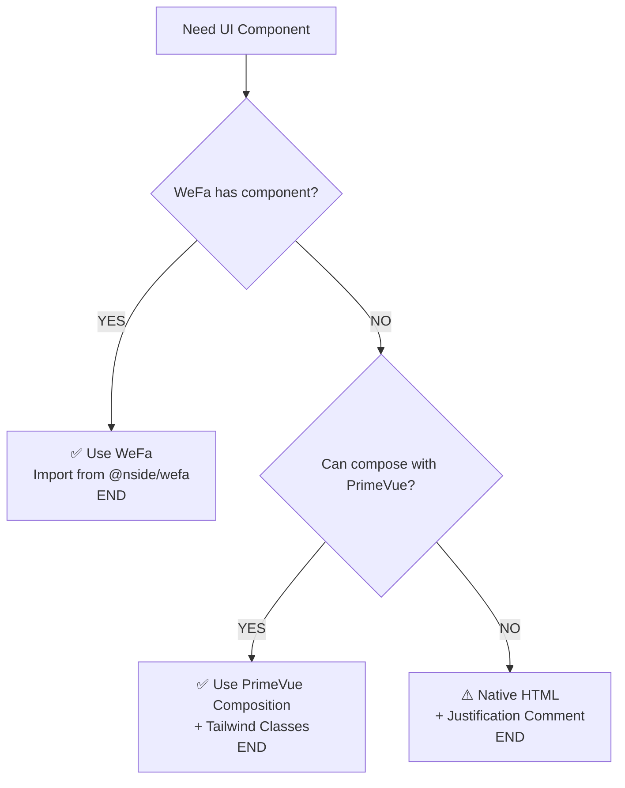

# N-SIDE WeFa- AI Agent Instructions

> **TARGET AUDIENCE**: AI Agents (Junie, GitHub Copilot, Claude, etc.)  
> **PROJECT TYPE**: Vue.js applications using N-SIDE WeFa
> **LAST UPDATED**: 2025-24-09

---

## 🤖 MANDATORY AI AGENT DIRECTIVES

### ⚡ INSTANT DECISION MATRIX

**WHEN IMPLEMENTING ANY UI COMPONENT:**

```
START → Need UI Component?
  ↓
1. ✅ CHECK: @nside/wefa has component?
   → YES: USE WeFa component → END
   → NO: Continue to step 2
  ↓
2. ✅ CHECK: Can compose solution with PrimeVue components?
   → YES: USE PrimeVue composition + Tailwind → END
   → NO: Continue to step 3
  ↓
3. ⚠️  LAST RESORT: Use native HTML
   → REQUIRED: Add comment explaining why steps 1-2 failed → END
```

---

## 🚨 CRITICAL DEVELOPMENT RULES

### Rule #1: Component Priority Hierarchy (ABSOLUTE ORDER)

**🥇 FIRST CHOICE**: N-SIDE WeFa Components
```javascript
// ALWAYS check these first - import from main package
import { 
  ControlBarComponent,     // Navigation/toolbar
  ConfiguredControlBarComponent,
  FormComponent,          // Dynamic forms
  TableComponent,         // Data tables
  RoutedTabsComponent,    // Tab navigation
  NetworkButton,          // Network operations
  NotFound               // 404 pages
} from '@nside/wefa'
```

**🥈 SECOND CHOICE**: PrimeVue Component Composition
- **PRIORITY**: Compose complex UI using multiple PrimeVue components
- **APPROACH**: Build custom functionality through composition
- **STYLING**: Apply Tailwind CSS classes exclusively
- **CATALOG**: https://primevue.org/

**🥉 LAST RESORT**: Native HTML Elements  
- **CONDITION**: Only when WeFa + PrimeVue cannot achieve the requirement
- **REQUIREMENT**: Must include detailed comment explaining why higher-priority options failed

### Rule #2: Styling - Tailwind CSS ONLY

**🚫 ABSOLUTELY FORBIDDEN (AUTO-REJECT):**

```vue
<!-- ❌ NEVER: Custom style blocks -->
<style scoped>
.custom-class { background: red; }
</style>

<!-- ❌ NEVER: CSS file imports -->
import './custom-styles.css'
```

**✅ REQUIRED APPROACH:**

```vue
<!-- ✅ ALWAYS: Use Tailwind classes -->
<div class="text-red-500 bg-white p-4 rounded-lg shadow-md"></div>
<Button class="bg-primary-500 hover:bg-primary-600 px-4 py-2 rounded-md"></Button>
```

**📚 STYLING RESOURCES:**
- **Tailwind Classes**: https://tailwindcss.com/docs
- **PrimeVue Integration**: Use `tailwindcss-primeui` package  
- **Theme System**: Leverage `@primeuix/themes` integration

---

## 📋 AI AGENT IMPLEMENTATION EXAMPLES

### ❌ VIOLATION EXAMPLE (AUTO-REJECT)

```vue
<template>
  <!-- ❌ VIOLATION: Custom HTML + Custom CSS -->
  <div class="custom-card">
    <h2 class="card-title">Title</h2>
    <button class="primary-btn" @click="handleClick">Action</button>
  </div>
</template>

<style scoped>
/* ❌ FORBIDDEN: Custom CSS */
.custom-card {
  background: white;
  padding: 20px;
  border-radius: 8px;
  box-shadow: 0 2px 4px rgba(0,0,0,0.1);
}
.primary-btn {
  background: blue;
  color: white;
  padding: 10px 20px;
}
</style>
```

### ✅ CORRECT IMPLEMENTATION PATTERNS

#### Pattern 1: WeFa First Choice
```vue
<template>
  <!-- ✅ PRIORITY 1: Use WeFa components when available -->
  <FormComponent 
    v-if="needsForm" 
    :config="formConfig" 
    class="mb-6"
  />
  
  <TableComponent 
    v-if="needsTable"
    :data="tableData"
    :columns="tableColumns"
    class="w-full"
  />
</template>

<script setup>
import { FormComponent, TableComponent } from '@nside/wefa'
</script>
```

#### Pattern 2: PrimeVue Composition (When WeFa Unavailable)
```vue
<template>
  <!-- ✅ PRIORITY 2: Compose with PrimeVue + Tailwind -->
  <Card class="bg-white shadow-lg rounded-lg border border-gray-200 mb-6">
    <template #title>
      <div class="flex items-center justify-between p-4 border-b border-gray-200">
        <h2 class="text-xl font-semibold text-gray-800">Dashboard</h2>
        <Button 
          icon="pi pi-refresh" 
          class="bg-primary-500 hover:bg-primary-600 text-white"
          @click="refresh"
        />
      </div>
    </template>
    
    <template #content>
      <div class="p-4 space-y-4">
        <!-- Compose multiple PrimeVue components -->
        <DataTable 
          :value="users" 
          class="border border-gray-300 rounded-md"
          paginator 
          :rows="10"
        >
          <Column field="name" header="Name" class="font-medium"></Column>
          <Column field="email" header="Email" class="text-gray-600"></Column>
          <Column>
            <template #body="slotProps">
              <div class="flex gap-2">
                <Button 
                  icon="pi pi-pencil" 
                  size="small"
                  class="bg-blue-500 hover:bg-blue-600 text-white px-2 py-1"
                  @click="editUser(slotProps.data)"
                />
                <Button 
                  icon="pi pi-trash" 
                  size="small"
                  class="bg-red-500 hover:bg-red-600 text-white px-2 py-1"
                  @click="deleteUser(slotProps.data)"
                />
              </div>
            </template>
          </Column>
        </DataTable>
      </div>
    </template>
  </Card>
</template>

<script setup>
import Card from 'primevue/card'
import Button from 'primevue/button'
import DataTable from 'primevue/datatable'
import Column from 'primevue/column'
</script>
```

#### Pattern 3: Complex Form Composition
```vue
<template>
  <!-- ✅ ADVANCED: Multi-component composition -->
  <Panel header="User Registration" class="bg-white shadow-md rounded-lg">
    <form @submit.prevent="submitForm" class="space-y-4 p-6">
      <div class="grid grid-cols-1 md:grid-cols-2 gap-4">
        <div>
          <label class="block text-sm font-medium text-gray-700 mb-2">
            First Name
          </label>
          <InputText 
            v-model="form.firstName"
            class="w-full border border-gray-300 rounded-md px-3 py-2 focus:ring-2 focus:ring-primary-500"
            placeholder="Enter first name"
          />
        </div>
        
        <div>
          <label class="block text-sm font-medium text-gray-700 mb-2">
            Department
          </label>
          <Dropdown 
            v-model="form.department"
            :options="departments"
            optionLabel="name"
            optionValue="id"
            placeholder="Select Department"
            class="w-full border border-gray-300 rounded-md"
          />
        </div>
      </div>
      
      <div class="flex justify-end space-x-3 pt-4 border-t border-gray-200">
        <Button 
          type="button"
          label="Cancel" 
          severity="secondary"
          class="bg-gray-200 hover:bg-gray-300 text-gray-700 px-4 py-2 rounded-md"
          @click="resetForm"
        />
        <Button 
          type="submit"
          label="Save User" 
          class="bg-primary-500 hover:bg-primary-600 text-white px-4 py-2 rounded-md"
        />
      </div>
    </form>
  </Panel>
</template>

<script setup>
import Panel from 'primevue/panel'
import InputText from 'primevue/inputtext'
import Dropdown from 'primevue/dropdown'
import Button from 'primevue/button'
</script>
```

## Component Usage Guidelines

### WeFa Components
```vue
<script setup>
// Always import WeFa components first
import { 
  ControlBarComponent,
  FormComponent, 
  TableComponent,
  NetworkButton 
} from '@nside/wefa'
</script>
```

### PrimeVue Components (when WeFa doesn't have equivalent)
```vue
<script setup>
// Import individual PrimeVue components
import DataTable from 'primevue/datatable'
import Column from 'primevue/column'
import InputText from 'primevue/inputtext'
import Dialog from 'primevue/dialog'
</script>
```

### Common Tailwind Patterns for PrimeVue
```vue
<template>
  <!-- Buttons -->
  <Button class="bg-primary-500 hover:bg-primary-600 px-4 py-2" />
  
  <!-- Cards -->
  <Card class="shadow-lg border border-gray-200 rounded-lg" />
  
  <!-- Forms -->
  <InputText class="w-full border border-gray-300 rounded-md px-3 py-2" />
  
  <!-- Tables -->
  <DataTable class="border border-gray-200 rounded-lg overflow-hidden" />
</template>
```

---

## 🔄 AI AGENT DECISION FLOW ALGORITHM

### 🎯 STEP-BY-STEP COMPONENT SELECTION



### 📋 MANDATORY VALIDATION CHECKLIST

**🔍 PRE-IMPLEMENTATION VALIDATION:**
Before writing any component code, AI agents MUST verify:

```
[ ] 1. COMPONENT CHECK: Searched @nside/wefa exports
[ ] 2. COMPOSITION CHECK: Evaluated PrimeVue component combination
[ ] 3. STYLING CHECK: Planned Tailwind-only approach
[ ] 4. FALLBACK CHECK: Prepared justification if using HTML
```

**✅ POST-IMPLEMENTATION VALIDATION:**
After writing component code, AI agents MUST validate:

```
[ ] ✅ IMPORT: WeFa components from '@nside/wefa'
[ ] ✅ IMPORT: PrimeVue components from 'primevue/[component]'
[ ] ✅ STYLING: Only Tailwind CSS classes used
[ ] ✅ FORBIDDEN: No <style> blocks, CSS files, inline styles
[ ] ✅ HIERARCHY: Priority order followed (WeFa → PrimeVue → HTML)
[ ] ✅ COMPOSITION: PrimeVue components composed before HTML fallback
[ ] ✅ DOCUMENTATION: HTML usage justified with comments
```

### 🚨 AUTO-REJECT TRIGGERS

**IMMEDIATE REJECTION if code contains:**
- `<style>` blocks or `.css` file imports
- `style="..."` inline attributes  
- Native HTML when PrimeVue composition possible
- Missing justification comments for HTML usage
- WeFa components not prioritized when available

---

## 📚 AI AGENT RESOURCE GUIDE

### 🎯 QUICK REFERENCE LINKS

| Resource Type           | Primary Source               | Purpose |
|-------------------------|------------------------------|---------|
| **WeFa Components**     | `@nside/wefa` package        | First-priority component lookup |
| **PrimeVue Components** | https://primevue.org/        | Second-priority component catalog |
| **Tailwind Classes**    | https://tailwindcss.com/docs | Styling reference |
| **Integration Guide**   | `tailwindcss-primeui` docs   | PrimeVue + Tailwind setup |

### 🔍 COMPONENT DISCOVERY WORKFLOW

**Step 1: WeFa Component Lookup**
```bash
# Check available exports
npm info @nside/wefa
# View TypeScript definitions  
node_modules/@nside/wefa/dist/types/index.d.ts
```

**Step 2: PrimeVue Component Search**
- Visit https://primevue.org/
- Use search: "input", "table", "dialog", etc.
- Import pattern: `import ComponentName from 'primevue/componentname'`

**Step 3: Tailwind Class Reference**
- Common patterns: `bg-`, `text-`, `p-`, `m-`, `flex`, `grid`
- Responsive: `sm:`, `md:`, `lg:`, `xl:`
- States: `hover:`, `focus:`, `active:`

### 🛠️ TROUBLESHOOTING GUIDE

**❌ Problem: WeFa component not found**
```javascript
// ✅ Solution: Verify import and check package exports
import { ComponentName } from '@nside/wefa'
// If not available → Move to PrimeVue composition
```

**❌ Problem: PrimeVue styling conflicts**
```javascript
// ✅ Solution: Use tailwindcss-primeui integration
// Ensure tailwind.config.js includes PrimeUI plugin
```

**❌ Problem: Complex UI requirements**
```javascript
// ✅ Solution: Compose multiple PrimeVue components
// Example: Card + DataTable + Button + Dialog
```

---

## ⚡ SUCCESS CRITERIA

**AI Agent implementation is SUCCESSFUL when:**
- ✅ WeFa components used when available
- ✅ PrimeVue composition preferred over native HTML
- ✅ All styling achieved through Tailwind classes
- ✅ No custom CSS files or style blocks present
- ✅ Code follows documented patterns and examples
- ✅ Native HTML usage is justified with comments

**🎖️ COMPLIANCE GUARANTEE**: Following these instructions ensures code review approval and maintains consistency across the projects.

